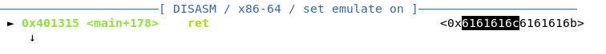
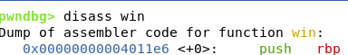

# Beginner's BOF
84 points

Source is from https://github.com/SECCON/Beginners_CTF_2022

The source file included with the challenge has a win function:
```c
void win() {
    char buf[0x100];
    int fd = open("flag.txt", O_RDONLY);
    if (fd == -1)
        err(1, "Flag file not found...\n");
    write(1, buf, read(fd, buf, sizeof(buf)));
    close(fd);
}
```

If this function is called, we get the flag.

The main function is as follows:
```c
int main() {
    int len = 0;
    char buf[BUFSIZE] = {0};
    puts("How long is your name?");
    scanf("%d", &len);
    char c = getc(stdin);
    if (c != '\n')
        ungetc(c, stdin);
    puts("What's your name?");
    fgets(buf, len, stdin);
    printf("Hello %s", buf);
}
```

BUFSIZE is defined as 0x10 (or 16 in decimal) in the source. So, we have a buffer of length 16. However, we have control over `len` when we answer `"How long is your name?"`. 

By having a "name" with length greater
than 16, part of the input name will overflow the buffer. Our goal is to find the length at which our name overwrites the return pointer to the adress of `win()`.

To find the offset, we use a de Brujin sequence, which is already built-in to `pwntools`. 

```python
p = process("./chall")
gdb.attach(p)

g = cyclic_gen()
payload = g.get(50)
idx = g.find(b'\x61\x61\x61\x6c')
print(idx)
```

Upon sending this payload, we see that we get a `segmentation fault`.



The code snippet above returns `41` for `idx`. This means that starting at index 41, we begin to control the return address. Because we want to return `win`, we want to add its address to our payload.

A simple `disass win` within gdb gives us the address (but we can use built-in functionailty within pwntools as well).



Our payload becomes 40 bytes of padding and the address of `win`. Sending the payload, returns the flag.

`ctf4b{Y0u_4r3_4lr34dy_4_BOF_M45t3r!}`