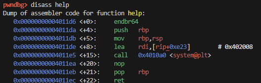

# Raindrop
134 points

It seems like this is a simple ROP challenge from provided source code:
```c
#include <stdio.h>
#include <stdlib.h>
#include <unistd.h>

#define BUFF_SIZE 0x10

void help() {
    system("cat welcome.txt");
}

void show_stack(void *);
void vuln();

int main() {
    vuln();
}

void vuln() {
    char buf[BUFF_SIZE] = {0};
    show_stack(buf);
    puts("You can earn points by submitting the contents of flag.txt");
    puts("Did you understand?") ;
    read(0, buf, 0x30);
    puts("bye!");
    show_stack(buf);
}

void show_stack(void *ptr) {
    puts("stack dump...");
    printf("\n%-8s|%-20s\n", "[Index]", "[Value]");
    puts("========+===================");
    for (int i = 0; i < 5; i++) {
        unsigned long *p = &((unsigned long*)ptr)[i];
        printf(" %06d | 0x%016lx ", i, *p);
        if (p == ptr)
            printf(" <- buf");
        if ((unsigned long)p == (unsigned long)(ptr + BUFF_SIZE))
            printf(" <- saved rbp");
        if ((unsigned long)p == (unsigned long)(ptr + BUFF_SIZE + 0x8))
            printf(" <- saved ret addr");
        puts("");
    }
    puts("finish");
}

__attribute__((constructor))
void init() {
    setvbuf(stdin, NULL, _IONBF, 0);
    setvbuf(stdout, NULL, _IONBF, 0);
    help();
    alarm(60);
}
```

`welcome.txt` even mentions this.

The buffer is defined to beof length 16 in function `vuln()`. And we already are reading in 48 bytes in to the buffer. `show_stack()` nicely shows us the contents of the stack, which we need to manipulate to call (I assume) `system("sh")`.

`system()` comes from `help()` and `"sh"` can come from `puts("finish")`.

Looking at the disassemly of `help()`, we verify that `system()` uses the value in `rdi` as the argument. The data at `0x402008` is loaded into `rdi` before `system` is called.



The data loaded is `"cat welcome.txt"`.


So, to get `system("sh")` called, we need `pop rdi, ret` and `$address of "sh"`.

We'll utilize pwntools's built-in functionality for finding gadgets, ROP.

To find our first gagdet, `pop rdi, ret`, we use:
```python
rop.raw(rop.find_gadget(['pop rdi', 'ret']))
```
* `find_gadget(instructions)` finds the exact sequence of instructions specified
* `raw(value)` adds a raw integer or string to the ROP chain. Note that it does not align values.

To find our next address, we use:
```python
rop.raw(pack(next(elf.search(b'sh\0'))))
```
* Note `elf` is defined as context in our solution script
* `elf.search(needle)` returns an iterator for each virtual address that matches the needle (bytes for string to search for)
* `next` is a python builtin to retrieve the next item from an iterator
* `pack(number)` packs an integer and keeps word-size, endianness, and signedness consistent with the context

At this point, our stack is ready to call `system()`. Looking back at the disassembly for `help()`, we see that the call for `system` occurs 15 bytes after the start of `help()`. So, we can add to our rop chain:
```python
rop.raw(pack(elf.sym['help']+15))
```

Lastly, we deal with padding. The total length of our rop chain turns out to be 24 bytes. We want our rop chain to start at the `ret address` which is 24 bytes away from where our buffer begins. 

This payload gives us a shell to `cat flag.txt` to get:

`ctf4b{th053_d4y5_4r3_g0n3_f0r3v3r}`